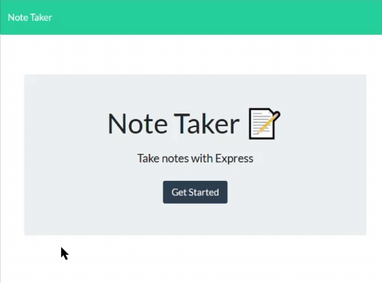

# Note Taker

## Description

This application uses express and sequelize to allow the user to write and save text notes to an online database. With this, the user will be able to keep track of tasks and ensure that their obligations get completed.

[Deployed with Heroku](https://lba-note-taker.herokuapp.com/)

## Usage

On app launch, the user will arrive on the hompe page. When the user clicks the "Get Started" button, they will be redirected to the notes page. On the notes page, the user input their note into the "note title" and "note text" fields. Once the text is entered (both fields must have text), the user clicks the floppy disk icon at the top right corner of the page to save their note. The save note will appear on the sidebar to the left. To view the full note, the user clicks on the note title. To delete the note, the user clicks the red trash can icon. To write a new note, the user clicks the pencil icon.

## Contributors

* Leighton Albrecht

[View Github repository](https://github.com/lbalbrecht/lba-note-taker)

